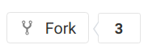
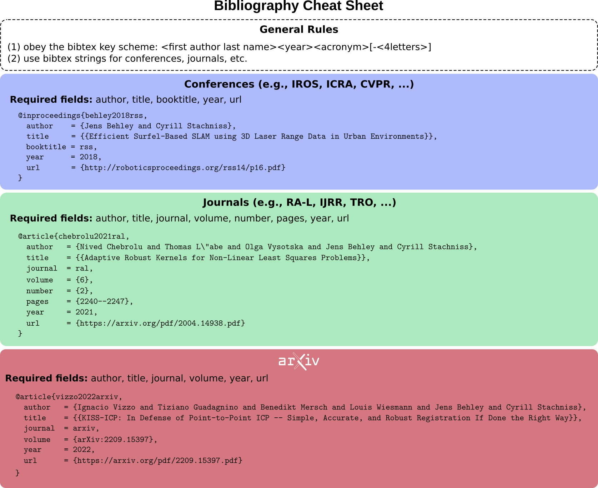

# IEEE paper template

This is a template paper in IEEE style (ICRA, IROS, RSS, RA-Letter, etc.), start
from this repository if you want to write a new paper.

[](/../-/jobs/artifacts/master/browse?job=make)

## How to start

- In GitLab:

  - [Fork](../../forks/new) this repo into YOUR personal workspace (you will be asked)! 
  - Change the name of the project: "Settings" -> "General project" -> "Project name" : `YOUR_PAPER` (Use the bibtex key policy described [below](#bibtex-key-policy))
  - Change the url of the project: "Settings" -> "Advanced" -> "Rename repository" -> "Path" : `YOUR_PAPER` (same as above)
  - Remove fork relationship: "Settings" -> "Advanced" -> "Remove fork relationship"
  - Transfer project to "papers" workspace: "Settings" -> "Advanced" -> "Transfer project" -> "Select new namespace" : `ipb-team / papers`. Note that this requires some permissions in the ipb-team workspace, so find someone with higher powers if needed.

- In your computer:
  - Install git-lfs before cloning the repository `sudo apt install git-lfs` if you are using Linux.
  - If all of the above was done, you can now happily clone the `YOUR_PAPER` project from `ipb-team/papers/YOUR_PAPER`
  - Rename the `paper.tex` file into `YOUR_PAPER.tex`.
  - Change line 3 of [`Makefile`](Makefile#L3) to match `YOUR_PAPER`.

## Must-follow paper writing tips

- Use a Spell Checker with US English as spelling language
- Use Academic Writing Check: https://github.com/devd/Academic-Writing-Check
- All images go to the subfolder `pics/`
- Make sure the source files for images are in the pics folder as well (unless
  they are huge). This is really helpful if you need to redo the images later
  for a journal or thesis
- Place the reviews as `.txt` files in the folder reviews.

## Bibtex key policy

You **MUST** follow this style of new bibentries. Here are the requirements:

- All in lower case
- Use the key structure: `<lastnamefirstauthor><4 digit year><conference/journal><extra>`
- Use `<extra>` **only** to disambiguate dash and first chars of the first
  4(6/8) words of the title
- Use the bibtex key also at the filename for the paper, e.g., `stachniss2008icra.tex`
- Example bibkeys:
  - `stachniss2008icra`
  - `stachniss2008icra-adhc`
  - `stachniss2008icraws`

## Bibtex entries tips



- Use strings (variables) for conferences and journal name in order to keep
  obtain consistent entries, e.g.,
  ```latex
  @STRING{icra = {Proc.~of the IEEE Intl.~Conf.~on Robotics \& Automation (ICRA)} }
  ```
  For more examples of these, see [`glorified.bib`](glorified.bib)
- Avoid adding location in addition to the city or street of the conference.
- Use doi for the official document on the publisher webpage.
- You can use full names, since the plain_abbrev style takes care of abbreviating. If you need, then there will be `glorified_abbrev.bib` and `new.bib` generated by `make`.

[fork]: https://gitlab.ipb.uni-bonn.de/global/templates-and-examples/template-paper-ieeeconf/forks/new
